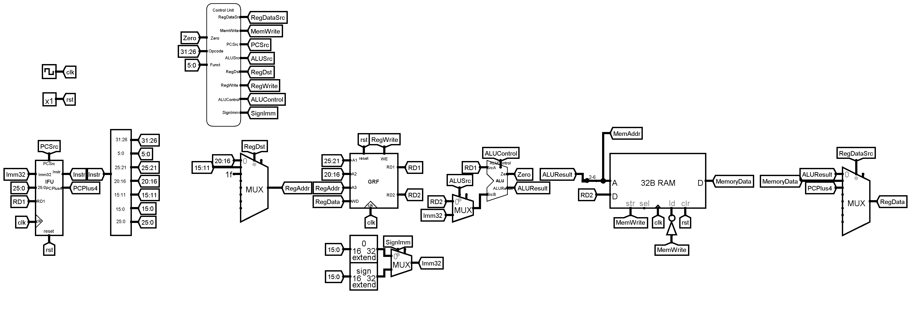
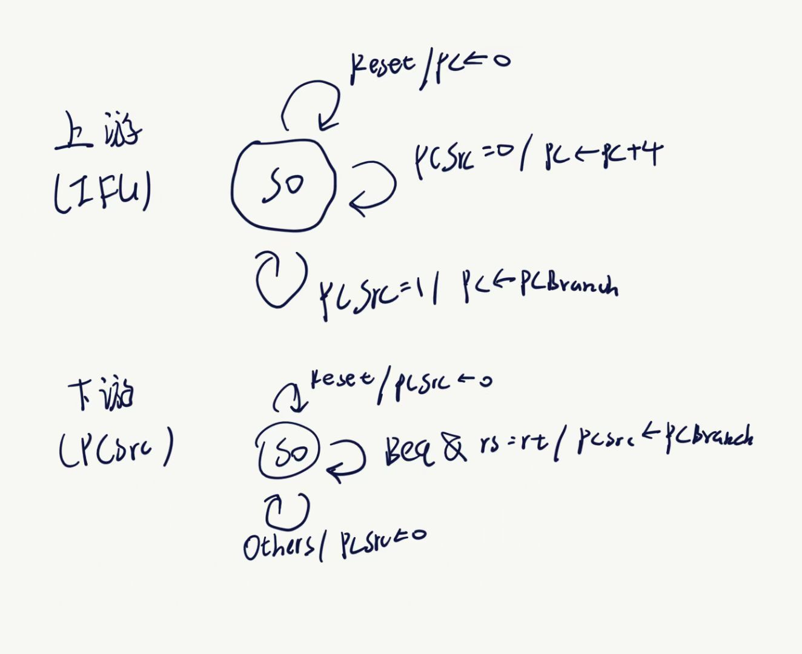

# PART ONE 设计草稿

## 实现指令

```assembly
add, sub, ori, lw, sw, beq, lui, nop
```

额外加上p4课下的

```
jal, jr
```


## 模块组成

- Instruction Fetch Unit

  - Program Counter

    使用Register

  - Instruction Memory

    使用ROM

- General Register File

  使用P0搭建的GRF

- Arithmetic Logic Unit

  使用Arithmetic模块

- Data Memory

  使用RAM

- Extender

  使用Bit Extender

  **注意符号问题**

- Controller

  - ALU Decoder
  
  - Main Decoder
  
    - ALUOP Decoder
    - RegDataSrc Decoder
    - PCSrc Decoder
    - RegDst Decoder
  
    底层结构使用教程的组织方法
  
- 顶层结构：

  

## 各指令机器码

### 三类指令结构


### Opcode & Funct

设计Main Decoder的“AND逻辑”时使用：

| R-Type | Opcode | Funct  |
| ------ | ------ | ------ |
| ADD    | 000000 | 100000 |
| SUB    | 000000 | 100010 |
| JR     | 000000 | 001000 |

| I-Type | Opcode |
| ------ | ------ |
| ORI    | 001101 |
| LW     | 100011 |
| SW     | 101011 |
| BEQ    | 000100 |
| LUI    | 001111 |

| J-Type | Opcode |
| ------ | ------ |
| JAL    | 000011 |

## Control Unit 编码

设计Main Decoder的“OR逻辑”时使用：

| Main  Decoder |       |             |          |                 |        |         |           |         |
| ------------- | ----- | ----------- | -------- | --------------- | ------ | ------- | --------- | ------- |
| Instr         | ALUOP | RegDataSrc* | MemWrite | PCSrc           | ALUSrc | RegDst* | RegWrite* | SignImm |
| R-Type        | 000   | 000         | 0        | 000             | 0      | 001     | 1         | x       |
| ORI           | 001   | 000         | 0        | 000             | 1      | 000     | 1         | 0       |
| LW            | 010   | 001         | 0        | 000             | 1      | 000     | 1         | 1       |
| SW            | 010   | x           | 1        | 000             | 1      | x       | 0         | 1       |
| BEQ           | 011   | x           | 0        | 001(条件满足时) | 0      | x       | 0         | 1       |
| LUI           | 100   | 000         | 0        | 000             | 1      | 000     | 1         | 0       |
| JAL           | x     | 010         | 0        | 010             | x      | 010     | 1         | x       |
| JR            | x     | x           | 0        | 011             | x      | x       | 0         | x       |

设计ALU Decoder部分时使用：

| ALUOP |                   | Funct  |      | ALU Control |                   |
| ----- | ----------------- | ------ | ---- | ----------- | ----------------- |
| 000   | see Funct         | 100000 | ADD  | 000         | ADD               |
| 001   | OR                | 100010 | SUB  | 001         | SUB               |
| 010   | ADD               |        |      | 010         | AND               |
| 011   | SUB               |        |      | 011         | OR                |
| 100   | SrcB Shift 16bits |        |      | 100         | SrcB Shift 16bits |

# PART TWO 测试方案

目前只测试了教程里的样例。

# PART THREE 思考题

> 1. 上面我们介绍了通过 FSM 理解单周期 CPU 的基本方法，请大家画出单周期 CPU 对应有限状态机的状态转移图，并谈谈它和我们之前见过的状态转移图有什么不同。

状态转移图：



不同点：每个Mealy状态机只有一个状态。


> 2. 现在我们的模块中 IM 使用 ROM， DM 使用 RAM， GRF 使用 Register，这种做法合理吗？ 请给出分析，若有改进意见也请一并给出。

在Logisim中合理，在现实中不合理。


> 3. 在上述提示的模块之外，你是否在实际实现时设计了其他的模块？如果是的话，请给出介绍和设计的思路。

设计了解析Instr的Splitter。

介绍：为了美观。

思路：把解析Instr的Splitter封装。


> 4. 事实上，实现 `nop` 空指令，我们并不需要将它加入控制信号真值表，为什么？

NOP指令不需要更改任何东西，而MemWrite，Branch，RegWrite默认都为零，所以不需要将它加入真值表。


> 5. 上文提到，MARS 不能导出 PC 与 DM 起始地址均为 0 的机器码。实际上，可以避免手工修改的麻烦。请查阅相关资料进行了解，并阐释为了解决这个问题，你最终采用的方法。

在MARS里先用“Compact, Data at Address 0"导出一遍，再用“Compact, Text at Address 0"导出一遍。


> 6. 阅读 Pre 的 [“MIPS 指令集及汇编语言”](http://cscore.buaa.edu.cn/tutorial/mips/mips-6/mips6-1/) 一节中给出的测试样例，评价其强度（可从各个指令的覆盖情况，单一指令各种行为的覆盖情况等方面分析），并指出具体的不足之处。

强度弱。各个指令覆盖范围小，单一指令覆盖范围也小。
