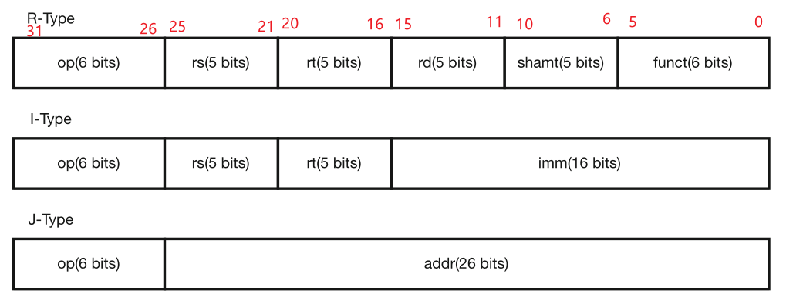

# PART ONE 设计草稿

## 实现指令

```json
add, sub, ori, lw, sw, beq, lui, jal, jr,nop
```

## 模块组成

### 模块层级

```json
- mips (mips.v)
	- IFU_TOP (IFU.v)
		- MUXinIFU (MUX.v)
		- InstrMem (ROM.v)
	- splitter_TOP (splitter.v)
	- ControlUnit_TOP (ControlUnit.v)
		- ALUDecoderInCU (ControlUnit_ALUDecoder.v)
			- MUXInALUDecoder (MUX.v)
		- MainDecoderInCU (ControlUnit_MainDecoder.v)
			- ALUOPDecoderInCU (ControlUnit_MainDecoder_SubUnits.v)
			- PCSrcDecoderInCU (ControlUnit_MainDecoder_SubUnits.v)
			- RegDataSrcDecoderInCU (ControlUnit_MainDecoder_SubUnits.v)
			- RegDstRecoderInCU (ControlUnit_MainDecoder_SubUnits.v)
	- RegAddrMUX (MUX.v)
	- GRF_TOP (GRF.v)
	- ALU_TOP (ALU.v)
		- MUXInALU (MUX.v)
	- DataMem (RAM.v)
	- RegDataMUX (MUX.v)
```

logisim 示意图：


## 各指令机器码

### 三类指令结构



### Opcode & Funct

设计Main Decoder的“AND逻辑”时使用：

| R-Type | Opcode | Funct  |
| ------ | ------ | ------ |
| ADD    | 000000 | 100000 |
| SUB    | 000000 | 100010 |
| JR     | 000000 | 001000 |

| I-Type | Opcode |
| ------ | ------ |
| ORI    | 001101 |
| LW     | 100011 |
| SW     | 101011 |
| BEQ    | 000100 |
| LUI    | 001111 |

| J-Type | Opcode |
| ------ | ------ |
| JAL    | 000011 |

## Control Unit 编码

设计Main Decoder的“OR逻辑”时使用：

| Main  Decoder |       |             |          |                 |        |         |           |         |
| ------------- | ----- | ----------- | -------- | --------------- | ------ | ------- | --------- | ------- |
| Instr         | ALUOP | RegDataSrc* | MemWrite | PCSrc           | ALUSrc | RegDst* | RegWrite* | SignImm |
| R-Type        | 000   | 000         | 0        | 000             | 0      | 001     | 1         | x       |
| ORI           | 001   | 000         | 0        | 000             | 1      | 000     | 1         | 0       |
| LW            | 010   | 001         | 0        | 000             | 1      | 000     | 1         | 1       |
| SW            | 010   | x           | 1        | 000             | 1      | x       | 0         | 1       |
| BEQ           | 011   | x           | 0        | 001(条件满足时) | 0      | x       | 0         | 1       |
| LUI           | 100   | 000         | 0        | 000             | 1      | 000     | 1         | 0       |
| JAL           | x     | 010         | 0        | 010             | x      | 010     | 1         | x       |
| JR            | x     | x           | 0        | 011             | x      | x       | 0         | x       |

设计ALU Decoder部分时使用：

| ALUOP |                   | Funct  |      | ALU Control |                   |
| ----- | ----------------- | ------ | ---- | ----------- | ----------------- |
| 000   | see Funct         | 100000 | ADD  | 000         | ADD               |
| 001   | OR                | 100010 | SUB  | 001         | SUB               |
| 010   | ADD               |        |      | 010         | AND               |
| 011   | SUB               |        |      | 011         | OR                |
| 100   | SrcB Shift 16bits |        |      | 100         | SrcB Shift 16bits |

# PART TWO 测试方案

目前只测试了教程里的样例。

# PART THREE 思考题

> 1. 阅读下面给出的 DM 的输入示例中（示例 DM 容量为 4KB，即 32bit × 1024字），根据你的理解回答，这个 addr 信号又是从哪里来的？地址信号 addr 位数为什么是 [11:2] 而不是 [9:0] ？

答：

（1）addr信号来自ALU模块计算结果。（2）因为题中DM内寄存器为按字对齐。


> 2. 思考上述两种控制器设计的译码方式，给出代码示例，并尝试对比各方式的优劣。

答：

*代码摘取自ControlUnit_MainDecoder.v和ControlUnit_MainDecoder_SubUnits.v。*

 **指令对应的控制信号如何取值**：

```verilog
module ALUOPDecoder (
    input RType, ORI, LW, SW, BEQ, LUI,
    output [2:0] ALUOP
);
    reg [2:0] ALUOPReg;
    assign ALUOP = ALUOPReg;
    always @(*) begin
        if (RType) begin
            ALUOPReg = 3'b000;
        end else if (ORI) begin
            ALUOPReg = 3'b001;
        end else if (LW) begin
            ALUOPReg = 3'b010;
        end else if (SW) begin
            ALUOPReg = 3'b010;
        end else if (BEQ) begin
            ALUOPReg = 3'b011;
        end else if (LUI) begin
            ALUOPReg = 3'b100;
        end else begin
            ALUOPReg = 3'b000;
        end
    end
endmodule
```

**控制信号每种取值所对应的指令**:

```verilog
assign RegWrite = RType | ORI | LW | LUI | JAL;
assign SignImm = LW | SW | BEQ;
```

第一种方式适合控制指令有多位的情况，第二种方式适合控制指令只有一位的情况。


> 3. 在相应的部件中，复位信号的设计都是**同步复位**，这与 P3 中的设计要求不同。请对比**同步复位**与**异步复位**这两种方式的 reset 信号与 clk 信号优先级的关系。

答：

同步复位中，clk优先于reset；异步复位中，reset优先于clk。

> 4. C 语言是一种弱类型程序设计语言。C 语言中不对计算结果溢出进行处理，这意味着 C 语言要求程序员必须很清楚计算结果是否会导致溢出。因此，如果仅仅支持 C 语言，MIPS 指令的所有计算指令均可以忽略溢出。 请说明为什么在忽略溢出的前提下，addi 与 addiu 是等价的，add 与 addu 是等价的。提示：阅读《MIPS32® Architecture For Programmers Volume II: The MIPS32® Instruction Set》中相关指令的 Operation 部分。

答：

ADDIU的RTL：

```json
temp <- GPR[rs] + sign_extend(immediate)
GPR[rt] <- temp
```

ADDI的RTL:

```JSON
temp <- (GPR[rs]31||GPR[rs]31..0) + sign_extend(immediate)
if temp32 != temp31 then
	SignalException(IntegerOverflow)
else
	GPR[rt] <- temp
endif
```

把ADDI中有关溢出的部分去掉，变为：

```json
temp <- GPR[rs] + sign_extend(immediate)
GPR[rt] <- temp
```

居然和ADDIU的RTL一模一样，太神奇了。

