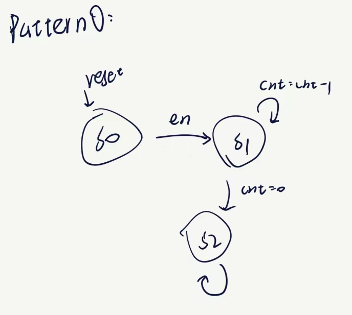
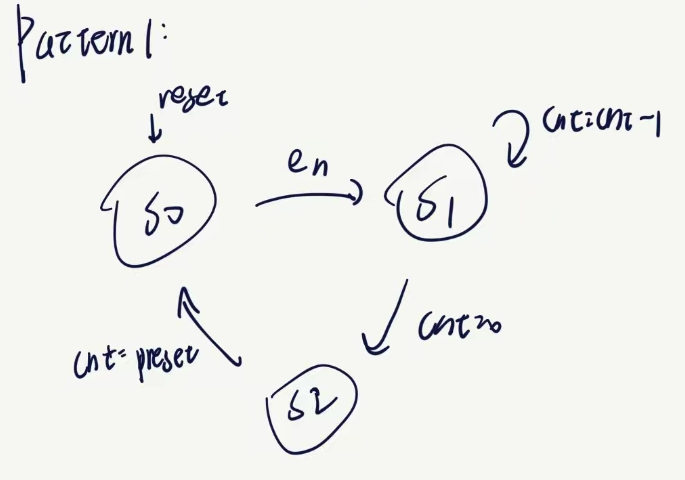

# PART ONE 设计草稿

## 实现指令

```json
RRCal Type:
	ADD, SUB, AND, OR, SLT, SLTU
RICal Type:
	ADDI, ANDI, ORI, LUI(AUI)
LM Type:
	LB, LH, LW
SM Type:
	SB, SH, SW
MD Type:
	MULT, MULTU, DIV, DIVU, MFHI, MFLO, MTHI, MTLO
B Type:
	BEQ, BNE
J Type:
	JAL, JR
NOP:
	NOP
MISC:
	MFC0, MTC0, ERET, SYSCALL
```

## 通用寄存器冒险解决思路

对于我的CPU结构，根据以下四条原则，可以写出所有的通用寄存器冒险处理逻辑。

1. 只有D级和E级需要转发。
   只有D级需要延迟。

2. D级需要的冲突数据只会来自于E级，M级，W级（内部转发）。
   E级需要的冲突数据只会来自于M级，W级。

3. 
   对于不写入寄存器(RegWrite==0)的指令，我们将它的TnewD设为0(不产生)，将它的WriteReg也设为0。

   对于不读取寄存器的指令，我们将它的TuseD设为3(不使用)。
   这样直接使用AT法时就不会出现错误的延迟和转发。

4. 使用AT法
   如果Tnew(E/M/W)==0且寄存器(D/E)==WriteReg(E/M/W)，则需要转发。
   如果TuseD<TnewD，则需要延迟。
   其中，根据每一条指令的RegDataSrc，Tnew何时为0是确定的。参见下图。


## 乘除寄存器冒险解决思路

对于我的CPU结构，根据以下两条原则，可以写出乘除寄存器的冒险处理逻辑。

1. 只有处于D级的读取HILO型指令需要延迟。

   只有处于D级的写入HILO型指令需要覆盖。

2. 读取HILO型指令在延迟后可以直接读取HILO，无需再次转发。

   写入HILO型指令直接覆盖原进程。

## CP0寄存器冒险解决思路

对于我的CPU结构，根据以下一条原则，可以写出CP0寄存器的冒险处理逻辑。

1. 只有处于D级的MFC0需要延迟。在HazardUnit中特判E、M级是否为MTC0且写入CP0寄存器相同即可。

## 顶层设计图

### CPU示意图


### MIPS微系统示意图



## 编码表格

### 三类指令结构


### TypeDecoder

| RRCal Type | Opcode/Funct  | RICal Type | Opcode/Funct                           | LM Type | Opcode/Funct |
| ---------- | ------------- | ---------- | -------------------------------------- | ------- | ------------ |
| ADD        | 000000/100000 | ADDI       | 001000                                 | LB      | 100000       |
| SUB        | 000000/100010 | ANDI       | 001100                                 | LH      | 100001       |
| AND        | 000000/100100 | ORI        | 001101                                 | LW      | 100011       |
| OR         | 000000/100101 | LUI(AUI)   | 001111                                 |         |              |
| SLT        | 000000/101010 |            |                                        |         |              |
| SLTU       | 000000/101011 |            |                                        |         |              |
|            |               |            |                                        |         |              |
|            |               |            |                                        |         |              |
|            |               |            |                                        |         |              |
|            |               |            |                                        |         |              |
|            |               |            |                                        |         |              |
| SM Type    | Opcode/Funct  | MD Type    | Opcode/Funct                           | B Type  | Opcode/Funct |
| SB         | 101000        | MULT       | 000000/011000                          | BEQ     | 000100       |
| SH         | 101001        | MULTU      | 000000/011001                          | BNE     | 000101       |
| SW         | 101011        | DIV        | 000000/011010                          |         |              |
|            |               | DIVU       | 000000/011011                          |         |              |
|            |               | MFHI       | 000000/010000                          |         |              |
|            |               | MFLO       | 000000/010010                          |         |              |
|            |               | MTHI       | 000000/010001                          |         |              |
|            |               | MTLO       | 000000/010011                          |         |              |
|            |               |            |                                        |         |              |
|            |               |            |                                        |         |              |
|            |               |            |                                        |         |              |
|            |               |            |                                        |         |              |
|            |               |            |                                        |         |              |
| J Type     | Opcode/Funct  | MISC       | Format                                 | NOP     |              |
| JAL        | 000011        | MFC0       | 31:21  010000_00000     10:3  00000000 | NOP     | 0x00000000   |
| JR         | 000000/001000 | MTC0       | 31:21  010000_00100     10:3  00000000 |         |              |
|            |               | ERET       | 0x42000018                             |         |              |
|            |               | SYSCALL    | 000000/001100                          |         |              |

### Hazard Unit

|                   | TnewD | TnewE | TnewM | TnewW |
| ----------------- | ----- | ----- | ----- | ----- |
| 写入ALUResult类   | 2     | 1     | 0     | 0     |
| 写入PCPlus8类     | 0     | 0     | 0     | 0     |
| 写入MemoryData类  | 3     | 2     | 1     | 0     |
| 写入MDUResult类   | 2     | 1     | 0     | 0     |
| 写入CP0Out类      | 3     | 2     | 1     | 0     |
|                   |       |       |       |       |
| 新增EPC引起的阻塞 |       |       |       |       |

### SignalDecoder_PCsrcDecoder

| Instr   | PCSrc   |      | Instr   | CMP  |
| ------- | ------- | ---- | ------- | ---- |
| B Type  |         |      | B Type  |      |
| BEQ     | 001     |      | BEQ     | 000  |
| BNE     | 001     |      | BNE     | 001  |
| J Type  |         |      | Others  | xxx  |
| JAL     | 010     |      |         |      |
| JR      | 011     |      | MISC    |      |
| Others  | 000     |      | MFC0    | xxx  |
|         |         |      | MTC0    | xxx  |
| MISC    |         |      | ERET    | xxx  |
| MFC0    | 000     |      | SYSCALL | xxx  |
| MTC0    | 000     |      |         |      |
| ERET    | 100/EPC |      |         |      |
| SYSCALL | x       |      |         |      |

### SignalDecoder_ImmEXTDecoder

| Instr      | SignImm |
| ---------- | ------- |
| RICal Type |         |
| ADDI       | 1       |
| ANDI       | 0       |
| ORI        | 0       |
| LUI(AUI)   | 1       |
| LM Type    |         |
| LB         | 1       |
| LH         | 1       |
| LW         | 1       |
| SM Type    |         |
| SB         | 1       |
| SH         | 1       |
| SW         | 1       |
| B Type     |         |
| BEQ        | 1       |
| BNE        | 1       |
| Others     | 0       |
|            |         |
| MISC       |         |
| MFC0       | 0       |
| MTC0       | 0       |
| ERET       | 0       |
| SYSCALL    | 0       |

### SignalDecoder_MemDecoder

| Instr   | ByteEnControl/Meaning |      | Instr   | MemDataControl/Meaning |
| ------- | --------------------- | ---- | ------- | ---------------------- |
| SM Type |                       |      | LM Type |                        |
| SB      | 001/addr[1:0]         |      | LB      | 001/addr[1:0]          |
| SH      | 010/addr[1]           |      | LH      | 010/addr[1]            |
| SW      | 011/1111              |      | LW      | 011/1111               |
| Others  | 000/0000              |      | Others  | 000/0000               |
|         |                       |      |         |                        |
| MISC    |                       |      | MISC    |                        |
| MFC0    | 000                   |      | MFC0    | 000                    |
| MTC0    | 000                   |      | MTC0    | 000                    |
| ERET    | 000                   |      | ERET    | 000                    |
| SYSCALL | 000                   |      | SYSCALL | 000                    |

### SignalDecoder_RegDecoder

| Instr      | RegWrite* | RegDataSrc* | RegDst* |
| ---------- | --------- | ----------- | ------- |
| RRCal Type |           |             |         |
| ADD        | 1         | 000         | 001     |
| SUB        | 1         | 000         | 001     |
| AND        | 1         | 000         | 001     |
| OR         | 1         | 000         | 001     |
| SLT        | 1         | 000         | 001     |
| SLTU       | 1         | 000         | 001     |
| RICal Type |           |             |         |
| ADDI       | 1         | 000         | 000     |
| ANDI       | 1         | 000         | 000     |
| ORI        | 1         | 000         | 000     |
| LUI(AUI)   | 1         | 000         | 000     |
| LM Type    |           |             |         |
| LB         | 1         | 001         | 000     |
| LH         | 1         | 001         | 000     |
| LW         | 1         | 001         | 000     |
| MD Type    |           |             |         |
| MULT       |           |             |         |
| MULTU      |           |             |         |
| DIV        |           |             |         |
| DIVU       |           |             |         |
| MFHI       | 1         | 010         | 001     |
| MFLO       | 1         | 010         | 001     |
| MTHI       |           |             |         |
| MTLO       |           |             |         |
| J Type     |           |             |         |
| JAL        | 1         | 011         | 010     |
| JR         |           |             |         |
| Others     | 0         | X(111)      | X(111)  |
|            |           |             |         |
| MISC       |           |             |         |
| MFC0       | 1         | 100/ CP0Out | 000     |
| MTC0       |           |             |         |
| ERET       |           |             |         |
| SYSCALL    |           |             |         |

### SignalDecoder_TimeDecoder

| Instr      | Tuse      | TnewD       |
| ---------- | --------- | ----------- |
| RRCal Type |           |             |
| ADD        | 1         | 2           |
| SUB        | 1         | 2           |
| AND        | 1         | 2           |
| OR         | 1         | 2           |
| SLT        | 1         | 2           |
| SLTU       | 1         | 2           |
| RICal Type |           |             |
| ADDI       | 1         | 2           |
| ANDI       | 1         | 2           |
| ORI        | 1         | 2           |
| LUI(AUI)   | 1         | 2           |
| LM Type    |           |             |
| LB         | 1         | 3           |
| LH         | 1         | 3           |
| LW         | 1         | 3           |
| SM Type    |           |             |
| SB         | 1         | 0(不产生)   |
| SH         | 1         | 0(不产生)   |
| SW         | 1         | 0(不产生)   |
| MD Type    |           |             |
| MULT       | 1         | 0(不产生)   |
| MULTU      | 1         | 0(不产生)   |
| DIV        | 1         | 0(不产生)   |
| DIVU       | 1         | 0(不产生)   |
| MFHI       | 3(不使用) | 2           |
| MFLO       | 3(不使用) | 2           |
| MTHI       | 1         | 0(不产生)   |
| MTLO       | 1         | 0(不产生)   |
| B Type     |           |             |
| BEQ        | 0         | 0(不产生)   |
| BNE        | 0         | 0(不产生)   |
| J Type     |           |             |
| JAL        | 3(不使用) | 0(已经产生) |
| JR         | 0         | 0(不产生)   |
| NOP        |           |             |
| NOP        | 3(不使用) | 0(不产生)   |
|            |           |             |
| MISC       |           |             |
| MFC0       | 3(不使用) | 3           |
| MTC0       | 1         | 0(不产生)   |
| ERET       | 3(不使用) | 0(不产生)   |
| SYSCALL    | 3(不使用) | 0(不产生)   |

### SignalDecoder_ALUDecoder

| Instr      | ALUControl/Meaning | ALUSrc |
| ---------- | ------------------ | ------ |
| RRCal Type |                    |        |
| ADD        | 0000/Add           | 0      |
| SUB        | 0001/Sub           | 0      |
| AND        | 0010/And           | 0      |
| OR         | 0011/Or            | 0      |
| SLT        | 0100/Less Than?    | 0      |
| SLTU       | 0101/Less Than U?  | 0      |
| RICal Type |                    |        |
| ADDI       | 0000/Add           | 1      |
| ANDI       | 0010/And           | 1      |
| ORI        | 0011/Or            | 1      |
| LUI(AUI)   | 0110/Add Upper Imm | 1      |
| LM Type    |                    |        |
| LB         | 0000/Add           | 1      |
| LH         | 0000/Add           | 1      |
| LW         | 0000/Add           | 1      |
| SM Type    |                    |        |
| SB         | 0000/Add           | 1      |
| SH         | 0000/Add           | 1      |
| SW         | 0000/Add           | 1      |
| Others     | X                  | X      |
|            |                    |        |
| MISC       |                    |        |
| MFC0       | X                  | X      |
| MTC0       | X                  | X      |
| ERET       | X                  | X      |
| SYSCALL    | X                  | X      |

### SignalDecoder_MDUDecoder

| Instr   | Start | MDUOP | ReadHILO | Time |
| ------- | ----- | ----- | -------- | ---- |
| MD Type |       |       |          |      |
| MULT    | 1     | 0001  | 00       | 5    |
| MULTU   | 1     | 0010  | 00       | 5    |
| DIV     | 1     | 0011  | 00       | 10   |
| DIVU    | 1     | 0100  | 00       | 10   |
| MFHI    | 0     | 1111  | 10       | 0    |
| MFLO    | 0     | 1111  | 01       | 0    |
| MTHI    | 0     | 0101  | 00       | 0    |
| MTLO    | 0     | 0110  | 00       | 0    |
| Others  | 0     | 0000  | 00       | 0    |

## SignalDecoder_CP0Decoder

| Instr   | CP0Write |
| ------- | -------- |
| MISC    |          |
| MFC0    | 0        |
| MTC0    | 1        |
| ERET    |          |
| SYSCALL |          |
| Others  | 0        |

# PART TWO 测试方案

使用工具：课程组Mars，Winmerge。

使用数据：

- https://github.com/rfhits/Computer-Organization-BUAA-2020
- https://github.com/flyinglandlord/BUAA-CO-2021

# PART THREE 思考题

> 1、请查阅相关资料，说明鼠标和键盘的输入信号是如何被 CPU 知晓的？

答：

把硬盘数据送到 CPU 过程是这样的：
硬盘先把数据送到**磁盘控制器缓冲区**，发出中断，CPU 发出指令把数据送到内存，最后才送到 CPU。

对于键盘，鼠标产生的数据，磁盘控制器缓冲区能一次性就能缓存这些数据，只需发一次中断给 CPU，CPU 再发出指令就能把数据送到内存。

*(来自网络)*


> 2、请思考为什么我们的 CPU 处理中断异常必须是已经指定好的地址？如果你的 CPU 支持用户自定义入口地址，即处理中断异常的程序由用户提供，其还能提供我们所希望的功能吗？如果可以，请说明这样可能会出现什么问题？否则举例说明。（假设用户提供的中断处理程序合法）

答：

（1）因为在计算NPC时，我们的CPU只能在检测到中断异常选择一个特定的地址。

（2）可以，那样要用指令向CPU专门写入中断异常处理地址用以选择。

（3）因为中断异常处理地址没有受到保护，可能在CPU运行过程中变成错误的地址。

> 3、为何与外设通信需要 Bridge？

答：

为了将CPU尽可能简洁的封装、为了遵循低内聚高耦合的设计原则。

> 4、请阅读官方提供的定时器源代码，阐述两种中断模式的异同，并分别针对每一种模式绘制状态移图。

答：

模式0可以持续产生中断信号，模式1只能产生一周期的中断信号。





> 5、倘若中断信号流入的时候，在检测宏观 PC 的一级如果是一条空泡（你的 CPU 该级所有信息均为空）指令，此时会发生什么问题？在此例基础上请思考：在 P7 中，清空流水线产生的空泡指令应该保留原指令的哪些信息？

答：

（1）此时宏观PC和宏观延迟指令错误。

（2）应该保留宏观PC和宏观延迟指令信息。

> 6、为什么 `jalr` 指令为什么不能写成 `jalr $31, $31`？

答：

同时读写$31寄存器的行为无法确定。

