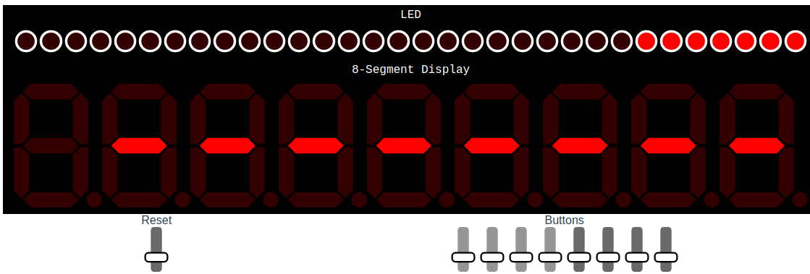
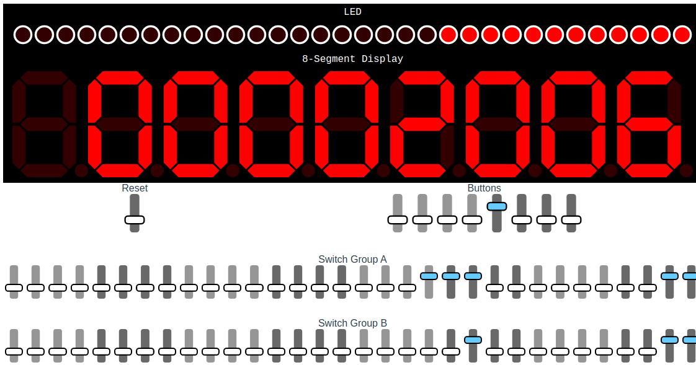
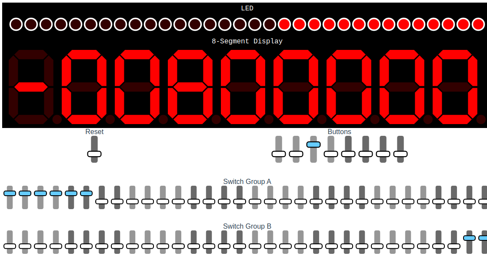
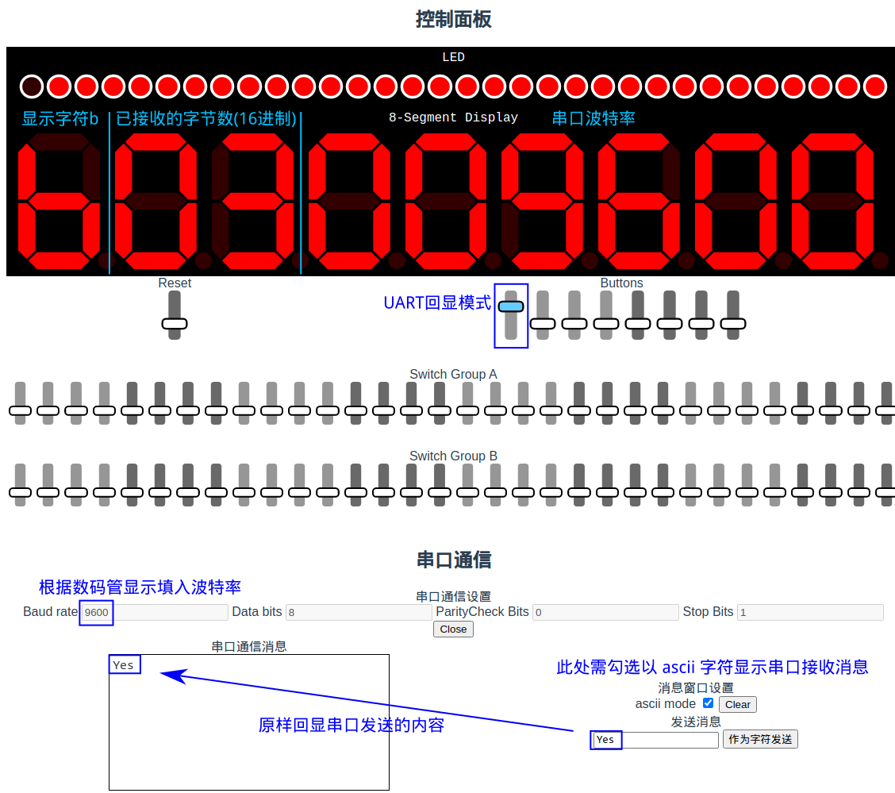
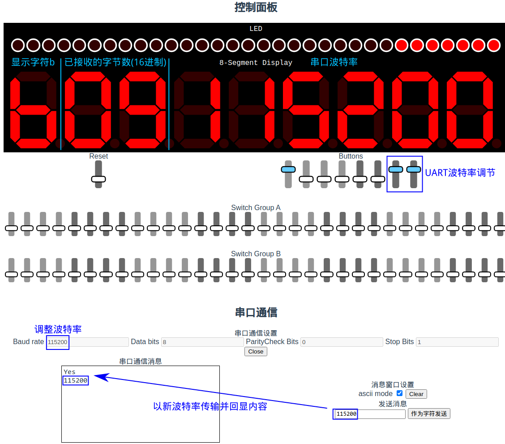

# FPGA 示例工程

包含实验 FPGA 全部外设交互（按键开关、拨码开关、数码管、LED、 UART 串口）的示例工程，用于熟悉远程 FPGA 操作或验证硬件工作正常。

示例工程不含有任何 IP 核，对 IP 核的介绍及学习将在 P8 进行。

## LED 流水灯

32 位 LED 灯按一定的时间间隔从右至左依次亮起，至全部亮起后全部熄灭，再次从右至左依次亮起，周期性循环往复。每个周期内 LED 亮起的时间间隔固定，相邻两个周期之间快慢交替。

## 功能模式选择

该示例电路有两种功能模式，分别为多功能计算器与 UART 串口回显。使用八位按键开关中最左一个选择功能模式，开关松开或按下分别对应计算器与串口回显。

## 多功能计算器

使最左侧的按键开关为松开状态，进入计算器模式。右侧的七个按键开关每个代表一种二元运算。**从右到左**每个按键开关依次代表的七种运算如下：

- `A & B`
- `A | B`
- `A ^ B`
- `A + B`
- `A - B`
- `A` 有符号右移 `B` 位（`B` 只考虑后 5 位）
- `A` 循环左移 `B` 位（`B` 只考虑后 5 位）

按下一个按键开关选择相应的运算（一次只能同时按下一个按键开关），并通过上下两行微动拨码开关分别输入两个 32 位二进制数 `A` 和 `B` （补码形式），拨码开关被按下代表这一位为 `1` ，松开代表 `0` 。运算结果以**有符号十六进制**显示在数码管上，最左侧一位数码管用来显示符号。若没有按下任何按键开关（未选择运算种类）或按下多于一个按键开关（选择了多于一种运算），则数码管不会显示任何计算结果，以 `--------` 表示空白（即上图初始状态的显示）。

计算器示例1：加法，结果为正数（ `0x1c03 + 0x403 = 0x2006` ）

计算器示例2：有符号右移，结果为负数（ `0xfc000000 >>> 0x3 = -0x00800000` ） 

## UART 串口回显

按下最左侧的按键开关进入串口回显模式，此时数码管最左侧一位显示字符 `b` ，右侧六位数码管显示当前可用的串口波特率。在实验平台最下方的串口通信区域填入对应的波特率后开启实验串口，向串口发送字符或字符串即可收到内容相同的回显。同时，从左往右数第 2、3 两位数码管（即最左字符 `b` 右侧的两位数码管）显示已经成功接收并回显的字节数（十六进制）。

调整最右侧的两位按键开关可切换波特率，共有 4 个档位，分别为 `9600` , `38400` , `57600` , `115200` 。切换波特率后，若实验串口此时处于打开状态，需先点击 `Close` 关闭串口后才能调整波特率。

注：若最左侧的按键开关处于松开状态，即功能模式选择为计算器模式，则串口不会回显，接收字节数也不会计数。

> 注：在当前阶段同学们暂时不需要掌握 UART 的原理与实现，仅通过该例程了解远程实验平台的串口操作即可。

串口操作图例：

